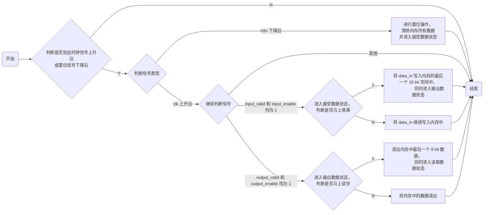
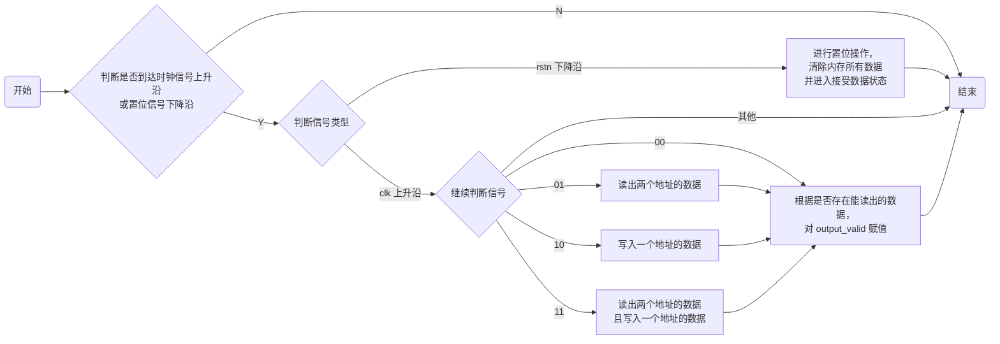
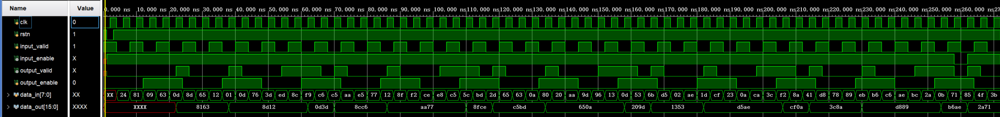

# REPORT 4 FIFO 实验

<p align="right">姓名：蓝宇舟 学号：2022K8009918005</p>

## 实验目的

- 熟悉 `verilog` 编程、调试

- 熟悉 FIFO 工作原理

- 实现功能较复杂的数字电路

## 实验环境

|  操作系统  | Vivado 版本 |  FPGA 器件芯片型号  |
| :--------: | :---------: | :-----------------: |
| Windows 11 |   2019.2    | xc7vx485tffg 1157-1 |

## 原理说明

### 正式实验

用流程图表示如下：



#### 说明

1. 在 `input` 状态下，当写到第 30 个地址时认为写满（因为一个地址储存 8 bit 数据，每次写入两个地址，即 16 bit）；

   同理，在 `output` 状态下，读到第 31 个地址时认为读空。

2. 本实验全程使用 **非阻塞赋值** ，所以在读 / 写到最后一个地址时，就应该转换 `input_enable` / `output_valid` 信号，并同时完成最后一个读 / 写操作，而不是等到读 / 写完后。

### 附加实验

因为题干没有要求读空后自动清除重新开始读数，所以我设计的 FIFO 在写满后直接停止工作

为方便判断，定义两个 `wire` 类型变量 `write_addr` 和 `read_addr` ：

```verilog
wire input_ev;
wire output_ev;
assign input_ev  = input_valid  && input_enable;
assign output_ev = output_valid && output_enable;
```

用流程图表示如下：



#### 说明

1. 和上一实验相比，本实验有两个最大区别：首先是输入输出的端口位宽发生了改变，其次是读取规则的变化。我们重点关注读取规则是怎样变化的。

2. 在本实验中，读写之所以能同时进行，是因为出现了 `input_enable` 和 `output_valid` 可以同时为 1 的情景。因此，我们首先需要修改 `input_enable` 和 `output_valid` 的值的改变规则：

   1. 对于 `input_enable`  信号，不需要作修改，依然是初始化为 1，当写满时赋值为 0。

   2. 而对于 `output_valid`  信号，只要内存中存在还没有读出的数据，都应该赋值为 1。因此，我们需要对该信号的赋值指定一个特定的规则，下面是具体实现方式：

      ```verilog
      case ({input_ev, output_ev})
          4'b00: begin
              if (write_addr - read_addr >= 2)begin  // 2 = 2
                  output_valid <= 1'b1;
              end
              else begin
                  output_valid <= 1'b0;
              end
          end
      
          4'b01: begin
      		...
              if (write_addr - read_addr >= 4)begin  // 2 + 2 = 4
                  output_valid <= 1'b1;
              end
              else begin
                  output_valid <= 1'b0;
              end
          end
      
          4'b10: begin
      		...
              if (write_addr - read_addr >= 1)begin  // 2 - 1 = 1
                  output_valid <= 1'b1;
              end
              else begin
                  output_valid <= 1'b0;
              end
          end
      
          4'b11: begin
      		...
              if (write_addr - read_addr >= 3)begin  // 2 + 2 - 1 = 3
                  output_valid <= 1'b1;
              end
              else begin
                  output_valid <= 1'b0;
              end
          end
      endcase
      ```
      
      关于 `write_addr` 和 `read_addr` 的定义，与老师所给示例相同，不再赘述。
      
      这里我对当前当前循环结束后的 `write_addr` 和 `read_addr` 的差值做了一个**预测**，并将四种不同预测情况的结果（是本次循环结束后的 `write_addr` 和 `read_addr` 预测值，不是当前值）和 2 进行比较（之所以和 2 比是因为一次读出连续 2 个地址中的内容），作为给 `output_valid` 赋值的判断条件。
      
      

##  接口定义

### 正式实验

| 输入端口                         | 位宽 | 输出端口                        | 位宽 |
| -------------------------------- | :--: | ------------------------------- | :--: |
| `clk` （时钟信号）               |  1   |                                 |      |
| `rstn` （同步置位信号）          |  1   |                                 |      |
| `input_valid` （输入有效信号）   |  1   | `input_enable` （输入使能信号） |  1   |
| `output_enable` （输出使能信号） |  1   | `output_valid` （输出有效信号） |  1   |
| `data_in` （数据输入端口）       |  16  | `data_out` （数据输出端口）     |  8   |

### 附加实验

| 输入端口                         | 位宽 | 输出端口                        | 位宽 |
| -------------------------------- | :--: | ------------------------------- | :--: |
| `clk` （时钟信号）               |  1   |                                 |      |
| `rstn` （同步置位信号）          |  1   |                                 |      |
| `input_valid` （输入有效信号）   |  1   | `input_enable` （输入使能信号） |  1   |
| `output_enable` （输出使能信号） |  1   | `output_valid` （输出有效信号） |  1   |
| `data_in` （数据输入端口）       |  8   | `data_out` （数据输出端口）     |  16  |

## 调试过程及结果

### 正式实验

波形图如下：

.png)

.png)

### 附加实验

波形图如下：



## 实验总结

- 通过本次实验，我学习到了有关 `memory`  的知识。之前在课堂上对计算机存储数据的方式有了大致的了解，经过本次实验，才更加深刻地体会到计算机的工作原理。

- 这也是我第一次接触到 `enable` （使能）信号，在实验中我逐渐认识到该信号的真正含义与用途，并将其和 `valid` （有效）信号加以区分。

- 此外，我还对 **阻塞赋值** 和 **非阻塞赋值** 有了一个全新的认识。在附加实验中，我起初通过一个简单的 **阻塞赋值** ，轻松完成了目标：

  ```verilog
  if (write_addr - read_addr >= 2) begin
      output_valid = 1'b1;
  end
  else begin
      output_valid = 1'b0;
  end
  ```

  这是我一开始的思路，因为这样可以保证在内存中存在未读出数据的时候，一旦外界给定的 `output_enable` 信号为真，立马就能将数据读出（如果采用非阻塞赋值，那么等到 `output_valid`  信号更新的时候， `output_enable` 信号已经改变了）。

  但通过查阅资料和老师以往讲义得知，这种做法虽然在本实验适用，但是在时序逻辑设计中应该尽量避免，因为在不同编译环境中会造成不可预测的结果。于是我换了一个思路，最终成功通过 **非阻塞赋值** 完成了设计，这进一步加深了我对时序电路设计相关知识的理解。

- 我最终的方法是根据当前循环中读写操作执行的结果做一个预测，由是否读 / 写共划分为四种情况，为了使代码简洁，我自学了 `verilog` 语言中 `case` 语句的用法，并通过自定义变量顺便温习了一下 `wire` 型变量和 `reg` 型变量的区别，也算是额外收获。

## 源代码

### 正式实验

#### 设计文件

```verilog
`timescale 1ns / 1ps

module fifo(
    input               clk,
    input               rstn,
    input               input_valid,
    input               output_enable,
    output reg          input_enable,
    output reg          output_valid,
    input       [15: 0] data_in,
    output reg  [ 7: 0] data_out
);

    reg [ 7: 0] mem [31: 0];
    reg [ 4: 0] write_addr;
    reg [ 4: 0] read_addr;

    always @(posedge clk or negedge rstn) begin
        if (rstn == 0)begin
            write_addr       <= 5'b0;
            read_addr        <= 5'b0;
            input_enable     <= 1'b1;
            output_valid     <= 1'b0;
            data_out[ 7:0]   <= 8'bxxxxxxxx;
        end
        else begin
            if ((input_valid == 1'b1) && (input_enable == 1'b1)) begin
                if (write_addr == 30) begin
                    input_enable   <= 1'b0;
                    output_valid   <= 1'b1;
                    write_addr     <= 5'b0;
                    mem[30][ 7: 0] <= data_in[ 7: 0];
                    mem[31][ 7: 0] <= data_in[15: 8];
                end
                else begin
                    write_addr                 <= write_addr + 2;
                    mem[write_addr][ 7: 0]     <= data_in[ 7: 0];
                    mem[write_addr + 1][ 7: 0] <= data_in[15: 8];
                end
            end
            else if (output_valid == 1'b1 && output_enable == 1'b1) begin
                if (read_addr == 31) begin
                    input_enable    <= 1'b1;
                    output_valid    <= 1'b0;
                    read_addr       <= 5'b0;
                    data_out[ 7: 0] <= mem[31][ 7: 0];
                end
                else begin
                    read_addr       <= read_addr + 1;
                    data_out[ 7: 0] <= mem[read_addr][ 7: 0];
                end
            end
            else begin
            end
        end
    end
endmodule
```

#### 激励测试文件

```verilog
`timescale 1ns / 1ps

module fifo_test(
);
    reg          clk;
    reg          rstn;
    reg          input_valid;
    wire         input_enable;
    wire         output_valid;
    reg          output_enable;
    reg  [15: 0] data_in;
    wire [ 7: 0] data_out;

    fifo inst_fifo_0(
        .clk(                       clk),
        .rstn(                     rstn),
        .input_valid(       input_valid),
        .input_enable(     input_enable),
        .output_valid(     output_valid),
        .output_enable(   output_enable),
        .data_in(               data_in),
        .data_out(             data_out)
    );

    always #2 begin
        clk = ~clk;
    end

    initial begin
        clk           = 1'b0;
        rstn          = 1'b1;
        input_valid   = 1'b1;
        output_enable = 1'b0;
        #1 rstn = 1'b0;
        #2 rstn = 1'b1;
    end

    always begin
        #4;
        data_in = $random() % 17'b1_00000000_00000000;
    end

    always begin
        #4;
        input_valid   = $random() % 2'b10;
        output_enable = $random() % 2'b10;
    end
endmodule
```

### 附加实验

#### 设计文件

```verilog
`timescale 1ns / 1ps

module fifo2(
    input               clk,
    input               rstn,
    input               input_valid,
    input               output_enable,
    output reg          input_enable,
    output reg          output_valid,
    input       [ 7: 0] data_in,
    output reg  [15: 0] data_out
);

    reg [ 7: 0] mem [31: 0];
    reg [ 4: 0] write_addr;
    reg [ 4: 0] read_addr;
    wire         input_ev;
    wire         output_ev;

    assign input_ev  = input_valid  && input_enable;
    assign output_ev = output_valid && output_enable;

    always @(posedge clk or negedge rstn) begin
        if (rstn == 0)begin
            write_addr      <= 5'b0;
            read_addr       <= 5'b0;
            input_enable    <= 1'b1;
            output_valid    <= 1'b0;
            data_out[ 7: 0] <= 8'bxxxxxxxx;
        end
        else begin
            case ({input_ev, output_ev})
                4'b00: begin
                    if (write_addr - read_addr >= 2)begin
                        output_valid <= 1'b1;
                    end
                    else begin
                        output_valid <= 1'b0;
                    end
                end

                4'b01: begin
                    if (read_addr == 30) begin
                        data_out[ 7: 0] <= mem[31][ 7: 0];
                        data_out[15: 8] <= mem[30][ 7: 0];
                    end
                    else begin
                        read_addr       <= read_addr + 2;
                        data_out[ 7: 0] <= mem[read_addr + 1][ 7: 0];
                        data_out[15: 8] <= mem[read_addr][ 7: 0];
                    end

                    if (write_addr - read_addr >= 4)begin
                        output_valid <= 1'b1;
                    end
                    else begin
                        output_valid <= 1'b0;
                    end
                end

                4'b10: begin
                    if (write_addr == 31) begin
                        input_enable = 1'b0;
                        mem[31][ 7: 0] <= data_in[ 7: 0];
                    end
                    else begin
                        write_addr             <= write_addr + 1;
                        mem[write_addr][ 7: 0] <= data_in[ 7: 0];
                    end

                    if (write_addr - read_addr >= 1)begin
                        output_valid <= 1'b1;
                    end
                    else begin
                        output_valid <= 1'b0;
                    end
                end
                
                4'b11: begin
                    if (write_addr == 31) begin
                        input_enable = 1'b0;
                        mem[31][ 7: 0] <= data_in[ 7: 0];
                    end
                    else begin
                        write_addr             <= write_addr + 1;
                        mem[write_addr][ 7: 0] <= data_in[ 7: 0];
                    end

                    if (read_addr == 30) begin
                        data_out[ 7: 0] <= mem[31][ 7: 0];
                        data_out[15: 8] <= mem[30][ 7: 0];
                    end
                    else begin
                        read_addr       <= read_addr + 2;
                        data_out[ 7: 0] <= mem[read_addr + 1][ 7: 0];
                        data_out[15: 8] <= mem[read_addr][ 7: 0];
                    end

                    if (write_addr - read_addr >= 3)begin
                        output_valid <= 1'b1;
                    end
                    else begin
                        output_valid <= 1'b0;
                    end
                end
            endcase
        end
    end
endmodule
```

#### 激励测试文件

```verilog
`timescale 1ns / 1ps

module fifo2_test(
);
    reg          clk;
    reg          rstn;
    reg          input_valid;
    wire         input_enable;
    wire         output_valid;
    reg          output_enable;
    reg  [ 7: 0] data_in;
    wire [15: 0] data_out;

    fifo2 inst_fifo2_0(
        .clk(                       clk),
        .rstn(                     rstn),
        .input_valid(       input_valid),
        .input_enable(     input_enable),
        .output_valid(     output_valid),
        .output_enable(   output_enable),
        .data_in(               data_in),
        .data_out(             data_out)
    );

    always #2 begin
        clk = ~clk;
    end

    initial begin
        clk           = 1'b0;
        rstn          = 1'b1;
        input_valid   = 1'b1;
        output_enable = 1'b0;
        #1 rstn = 1'b0;
        #2 rstn = 1'b1;
    end

    always begin
        #4;
        data_in = $random() % 9'b1_0000_0000;
    end

    always begin
        #4;
        input_valid   = ~input_valid;
    end

    always begin
        #12;
        output_enable = ~output_enable;
    end
endmodule
```
